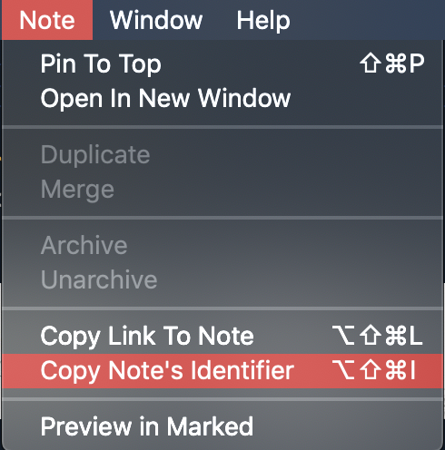

## About

This is Python script for Bear app, can auto generate TOC of a bear note.

See the `input.md` & `output.md`.

## How to use

First, you need Python 3.x

Clone this or download the package.

Copy user notes to `input.md`

Find your note id here

Then use the terminal app go to the this folder. Type the command `python app.py -n replace_this_as_your_note_id`

And the TOC will auto generated to `output.md`

